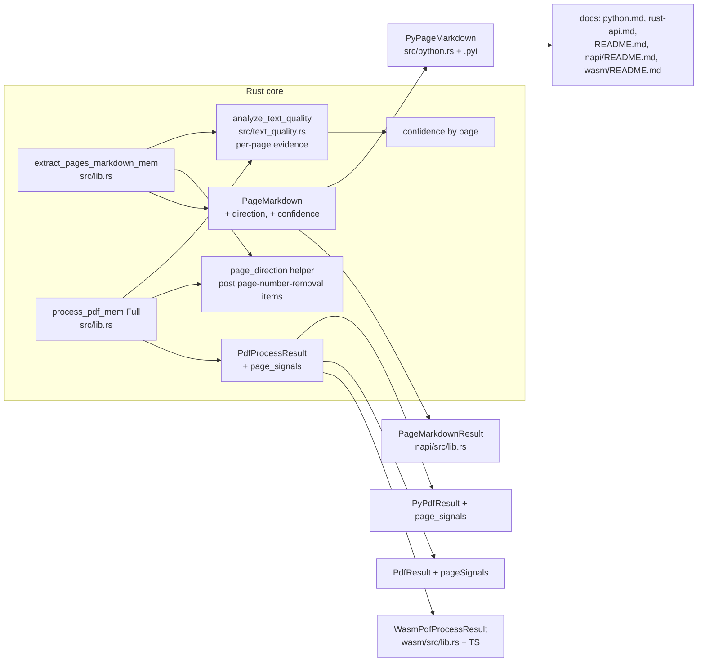

# Expose detector signals: reading direction and per-page confidence - Plan

## Goal Capsule

- **Objective:** Expose two signals the library computes internally — reading direction (LTR/RTL/mixed) and per-page text confidence — as additive fields on per-page extraction results and Full-mode process results, across the Rust, Python, napi, and wasm surfaces; document the `ocrReason` vocabulary and type it in the hand-maintained wasm TS declarations.
- **Authority:** This plan implements GitHub issue #217 (https://github.com/firecrawl/pdf-inspector/issues/217). Product scope is fixed by the issue; the user selected this issue over the other open no-PR issues after a triage review.
- **Stop conditions:** Any change to extracted text, markdown, `pdf_type`, document-level confidence, classification output, or CLI JSON output is out of scope and stops the unit. Any change to detector sampling or classification thresholds stops the unit.
- **Execution profile:** Standard depth; 6 implementation units; no phased delivery.
- **Tail ownership:** ce-work owns implementation through commit; PR/landing is owned by the calling pipeline (LFG).

## Product Contract

### Summary

`pdf-inspector` routes documents to OCR based on classification and per-page signals. Today the caller learns *which* pages were flagged (`pages_needing_ocr`) but not *how degraded* the per-page text quality is, and cannot tell whether the RTL extraction path fired on a page (reading direction). Both signals are computed internally and discarded before the public API. This plan exposes them on per-page extraction results and Full-mode process results across all surfaces, and documents the machine-readable `ocrReason` vocabulary. No runtime behavior changes.

### Problem Frame

Two failure modes motivated the issue:

1. When RTL handling misfires (issue #212), the caller sees plausible-looking text with no indication that script-specific ordering applied. A wrong answer is indistinguishable from a correct one. A page-level `direction` makes the RTL path self-diagnosing.
2. When classification flags many pages for OCR (issue #213), the caller cannot tell whether pages were flagged marginally or emphatically. Per-page confidence turns that into a one-line report.

Both are additive: neither changes any behavior, so they can land independently of the fixes (#212, #213) they help diagnose.

### Requirements

- R1. **Page-level reading direction.** Per-page extraction results and Full-mode process results expose a direction value (`"ltr"`, `"rtl"`, or `"mixed"`) on the Rust, Python, napi, and wasm surfaces.
- R2. **Per-page confidence.** Per-page extraction results and Full-mode process results expose a confidence score (0.0–1.0) on the same four surfaces, derived from existing per-page text-quality evidence, with the formula pinned in KTD4. The field measures text-quality evidence, not the strength of the classifier's routing decision; this contract framing is documented per KTD4.
- R3. **Runtime behavior neutrality.** The change alters no existing output at runtime: extracted text, markdown, `pdf_type`, document-level confidence, `pages_needing_ocr`, `ocr_reasons_by_page`, and CLI JSON output stay identical.
- R4. **ocrReason vocabulary contract.** Public docs enumerate the four OCR reason literals, their per-page multi-value semantics, and their emission context; hand-maintained wasm TS declarations type the vocabulary as a union.
- R5. **Cross-surface parity.** New fields are mirrored through the full chain (Rust struct → Python pyclass + converter + `.pyi` stub → napi struct + converter → wasm struct + TS → docs), and indexing conventions are documented per surface.
- R6. **Surface tests.** Every exposed surface gains coverage for the new fields, and the existing suite (unit, integration, Python, napi, wasm) passes unchanged.

### Acceptance Examples

- AE1. A page whose text layer is Hebrew-only returns `direction = "rtl"`, `confidence = 1.0`, `needs_ocr = false` from `extract_pages_markdown` on the Rust, Python, and napi surfaces. *(Covers R1, R2)*
- AE2. A blank page with no text and no image returns `direction = "ltr"`, `confidence = 0.0`, `needs_ocr = true`. *(Covers R1, R2)*
- AE3. `process_pdf` in Full mode on a Hebrew-only PDF returns `page_signals` (per-page direction + confidence) populated for every processed page, with `direction = "rtl"` and `confidence = 1.0`; DetectOnly and Scanned/ImageBased modes return an empty `page_signals`. *(Covers R1, R2)*

### Scope Boundaries

- **In scope:** `PageMarkdown` direction + confidence and their Python/napi mirrors; per-page direction + confidence on Full-mode process results (`PdfProcessResult` / `PyPdfResult` / napi `PdfResult` / wasm `PdfProcessResult`) via a per-page signals container; per-page text-quality confidence derivation; `ocrReason` documentation; wasm TS union typing; integration, Python, napi, and wasm tests.
- **Deferred to Follow-Up Work:**
  - Per-page confidence on the lightweight classify/detect path (`PdfClassification` / `PdfTypeResult`). The detector analyzes only sampled pages (default `ScanStrategy::Sample(8)`); per-page numbers there would either mislead or require changing detection cost. Known limitation: diagnosing #213's marginal-vs-emphatic question on the classify path alone requires a Full-mode or extraction run. A concrete follow-up shape exists: expose per-page confidence for the pages the detector actually analyzed (from the existing `PageAnalysis` map, without changing sampling), documented as sampled-only.
  - Per-`TextItem` `isRtl`. Larger parity surface across the public `TextItem` mappings for marginal gain.
  - Fixing RTL ordering behavior (issue #212) and Arabic classification (issue #213).
  - Marking `PageMarkdown` / process-result structs `#[non_exhaustive]`; the compile-time-break caveat in A6 is adopted instead for this change.
- **Outside this product's identity:** changing detector sampling, thresholds, or classification behavior; changing CLI JSON output shape; migrating `ocrReason` from `String` to a Rust enum (a breaking type change across all bindings).

## Planning Contract

### Key Technical Decisions

- KTD1. **Direction is page-level, not per-`TextItem`.** The signal lives as one field per page (`PageMarkdown.direction` and a per-page entry in Full-mode `page_signals`), not on `TextItem`. Rationale: `TextItem` is publicly mapped on every surface (python `convert_text_items`, napi `TextItem`, `.pyi`, docs), so a per-item flag multiplies the parity surface; page-level matches the existing per-page signal style (`pages_with_tables`, `pages_with_columns`, `ocr_reasons_by_page`). The issue offered either shape.
- KTD2. **Direction semantics.** Direction is aggregated per line over the page's text items **after page-number-removal filtering** — the same items that feed the emitted per-page markdown — so the signal matches the output a caller can inspect (the removal mask already exists in `extract_pages_markdown_mem`, lib.rs:536). A line is a group of items on the same page within the extractor's line-merging y tolerance, mirroring the grouping the RTL ordering path itself uses. Per line, count RTL vs LTR characters using the same counters `is_rtl_text` uses (`src/text_utils.rs`). Line classes: RTL-dominant when `rtl > 0 && rtl > ltr`; LTR-dominant when `ltr > 0 && ltr >= rtl`; neutral otherwise (digits/punctuation-only, CJK-only, empty). Page classes: `"rtl"` when at least one RTL-dominant line and no LTR-dominant line; `"mixed"` when at least one of each; `"ltr"` otherwise (including neutral-only and empty pages). Documented consequences, pinned by unit tests: a CJK line counts as neutral (CJK is neither RTL nor LTR in `is_rtl_text`), so a CJK page with one embedded Arabic word is `"rtl"`; a Hebrew page whose Latin page-number footer is removed by filtering is `"rtl"`, while a Hebrew page with a surviving English title is `"mixed"`. Any page with an RTL-dominant line — including `"mixed"` — had RTL ordering applied, so callers keying on RTL must test `direction != "ltr"`. Direction is only meaningful when the text layer is reliable (`needs_ocr = false`).
- KTD3. **Per-page confidence lives where all processed pages are analyzed.** Per-page confidence is derived in two paths: `extract_pages_markdown_mem` (every requested page extracted) and `process_pdf_mem` Full mode (every filtered page extracted; `analyze_text_quality` already runs there, lib.rs:3821). The lightweight classify/detect path keeps document-level confidence only (KTD-deferred per Scope Boundaries). The confidence map is near-zero-cost because `analyze_text_quality` already runs in both paths; direction adds one additional O(items) pass per path.
- KTD4. **Confidence formula.** `confidence` is a deterministic function of per-page text-quality evidence already collected by `analyze_text_quality` (`src/text_quality.rs`). Reference formula (constants validated by unit tests):
  - `chars == 0` (no extractable text) → `0.0`.
  - Binary garbled evidence — cipher-garble (`cipher_garble.looks_garbled()`) or a Strong-span flag (dollar-as-space, private-use runs, C1 controls, item-level CID garbage) — → `0.15`.
  - Otherwise → `max(0.0, 1.0 - min(1.0, replacement_density_bps / 1000.0))`, where `replacement_density_bps` is per-page replacement characters per 10,000 non-whitespace chars. Clean page → `1.0`; page at the existing 500-bps OCR threshold → `0.5`; ≥ 1000 bps → `0.0`.
  - Implementation note: the 0.15 branch fires only on binary garbled evidence — per-page cipher-garble (`looks_garbled()`) or a Strong-span flag, tracked separately per page. Replacement-evidence pages (which can be flagged via `page_replacement_evidence_needs_ocr`) are graded by the third branch instead, so a page at the 500-bps replacement threshold scores 0.5, not 0.15. `analyze_text_quality` already skips the replacement/cipher checks for pages flagged by Strong issues, so a Strong-flagged page still lands at 0.15.
  - Known divergence, documented: GID-font pages and pages flagged only by markdown-level checks can show `needs_ocr = true` with high confidence; the field measures per-page text-quality evidence, not the final `needs_ocr` decision.
- KTD5. **ocrReason stays string-typed; the vocabulary is documented, and only hand-maintained TS gets a union.** The four literals are the Rust constants in `src/lib.rs` (`suspected_garbled_text`, `scanned`, `no_text`, `vector_text`). `ocrReason` remains `String`/`str` on every surface (no Rust enum migration — a breaking type change). Docs scope the vocabulary to the multi-valued `ocr_reasons_by_page` surface: on the extraction path, `PageMarkdown.ocr_reason` only ever carries `suspected_garbled_text` or `None`. Docs state the merge order (detector reasons first, text-quality garbled appended, deduped) and that `phantom_empty_row`, `detection_error`, and `multi_row_in_cell` are TSR table fallback labels, not OCR reasons. The hand-maintained wasm `typescript_custom_section` declares `type OcrReason = "suspected_garbled_text" | "scanned" | "no_text" | "vector_text"` and uses it for `PageOcrReasons.reasons`; a comment requires updating the union together with the Rust constants.

### Assumptions

- A1. Indexing: `PageMarkdown.page` and its new fields are 0-indexed; the Full-mode `page_signals` container follows its host result's convention (1-indexed `page`, matching `pages_needing_ocr` on process results). Docs state this next to each field.
- A2. Pages with no text items (blank, image-only, out-of-range requested pages) return `direction = "ltr"` and `confidence = 0.0`, mirroring the existing out-of-range convention (entry returned, `needs_ocr = true`). Applies to both `PageMarkdown` and Full-mode `page_signals`.
- A3. The direction and confidence computations stay internal (`pub(crate)` helpers); no new public API beyond the result fields.
- A4. No external research is needed: the additive per-page field chain has multiple in-repo precedents (`pages_with_tables`, `pages_with_columns`, `ocr_reasons_by_page`, `needs_ocr`), and the repo has no `solutions/` knowledge base to consult.
- A5. CI does not build the Python or napi bindings; verification of those surfaces is a manual step in the Verification Contract.
- A6. Adding public fields is compile-time breaking for Rust struct-literal construction and for napi-generated TS object construction; the release is semver-minor. Runtime output stays identical (R3).

### Data-flow sketch

## Implementation Units

### U1. Rust core: `PageMarkdown` gains direction and confidence

- **Goal:** Add `PageDirection` (or equivalent enum), `PageMarkdown.direction`, and `PageMarkdown.confidence`; compute both in `extract_pages_markdown_mem`.
- **Requirements:** R1, R2, R3
- **Dependencies:** none
- **Files:**
  - `src/lib.rs` — `PageMarkdown` struct (line ~410); both `PageMarkdown` construction sites in `extract_pages_markdown_mem` (~line 524 and ~line 598) plus the out-of-range branch (~line 520); a `PageDirection` enum with `as_str()` → `"ltr" | "rtl" | "mixed"`; inline unit tests
  - `src/text_quality.rs` — `TextQualityReport` gains a per-page confidence map computed inside `analyze_text_quality` from the existing `PageTextQualityEvidence`; the map is shared by U6
  - `src/text_utils.rs` or `src/extractor/mod.rs` — internal `pub(crate)` page-direction helper implementing KTD2 (line grouping + per-line `is_rtl_text` counts); inline unit tests
- **Approach:**
  1. Add the `PageDirection` enum (KTD1) with a `&'static str` projection.
  2. Extend `analyze_text_quality` to also emit per-page confidence per KTD4 (empty → 0.0; garbled evidence including Strong-span → 0.15; else density-graded, clamped to [0.0, 1.0]; guard `chars == 0`).
  3. Add the page-direction helper per KTD2 (operating on the post-page-number-removal items) and unit-test the classification rules (RTL-dominant / LTR-dominant / neutral; tie → LTR; CJK neutral).
  4. Populate both fields in every `PageMarkdown` construction site in `extract_pages_markdown_mem`, including the out-of-range branch (A2).
  5. Pin `confidence: f32` in the core struct, matching the `PdfProcessResult.confidence` precedent; the napi surface widens to `f64`.
  6. Do not touch `PdfProcessResult`, `PdfClassification`, `PdfTypeResult`, the detector, or the CLI serializers in this unit (R3).
- **Patterns to follow:** the additive per-page field precedent `needs_ocr` / `ocr_reason` on `PageMarkdown`; `is_rtl_text` in `src/text_utils.rs`; the existing `PageTextQualityEvidence` accumulation loop in `analyze_text_quality`.
- **Test scenarios:**
  - Clean single-paragraph Latin page → `direction = "ltr"`, `confidence = 1.0`.
  - Hebrew-only page → `direction = "rtl"`, `confidence = 1.0`.
  - Page with one Hebrew line and one Latin line → `direction = "mixed"`.
  - Page with only digits/punctuation → `direction = "ltr"`.
  - Page with no text items (blank/image-only) and out-of-range requested page → `direction = "ltr"`, `confidence = 0.0`.
  - Page whose text is empty (`chars == 0`) → `confidence = 0.0` (no NaN/div-by-zero).
  - Replacement-heavy page at the 500-bps OCR threshold → `confidence = 0.5`.
  - Replacement-saturated page (≥ 1000 bps) → `confidence = 0.0`.
  - Moderate replacement density below the OCR threshold → `confidence` strictly between 0.5 and 1.0.
  - Cipher-garbled (shifted) page → `confidence = 0.15`.
  - Strong-span-garbled page (private-use runs / dollar-as-space / C1 controls) → `confidence = 0.15`.
  - CJK page with one embedded Arabic word → `direction = "rtl"` (parity with `is_rtl_text`).
  - Hebrew page whose Latin footer is removed as a page number → `direction = "rtl"`.
- **Verification:** `cargo test` passes with the new inline tests; `cargo fmt` and `cargo clippy -- -D warnings` clean; no existing test or snapshot changes (R3).
- **Execution note:** add the direction-helper unit tests first, then the confidence tests; the rest is wiring.

### U2. Integration tests: synthetic RTL/mixed fixtures and confidence assertions

- **Goal:** Prove the new fields end-to-end on real parsed PDFs and lock runtime behavior neutrality.
- **Requirements:** R1, R2, R3, R6
- **Dependencies:** U1, U6 (for the Full-mode assertions)
- **Files:**
  - `tests/integration_tests.rs` — new `#[test]` cases plus a synthetic-PDF builder (or builders) for RTL and mixed-script pages, following the existing `make_text_pdf` pattern; assertions on `PagesExtractionResult` / `PageMarkdown` fields and Full-mode `PdfProcessResult.page_signals`
  - `tests/snapshots/` — unchanged; used to prove behavior neutrality
- **Approach:**
  1. Add a fixture builder that writes text with Hebrew/Arabic characters (and Latin) into a text PDF, mirroring `make_text_pdf`.
  2. Assert `direction` and `confidence` for: Hebrew-only page (`rtl`, 1.0); mixed Hebrew+Latin page (`mixed`); blank page (`ltr`, 0.0); garbled page (low confidence).
  3. Assert `confidence`/`direction` are populated only for requested pages when `pages = Some([...])`.
  4. Assert Full-mode `page_signals` on an RTL fixture: populated for processed pages, empty in DetectOnly mode.
  5. Assert existing golden snapshots and existing assertions are byte-identical before/after (R3).
- **Patterns to follow:** `make_text_pdf` builder and snapshot assertions in `tests/integration_tests.rs`; the per-page reason assertion at ~line 1619.
- **Test scenarios:**
  - Hebrew-only page via the synthetic builder → `direction = "rtl"`, `confidence = 1.0`, `needs_ocr = false` (AE1).
  - Blank page → `direction = "ltr"`, `confidence = 0.0`, `needs_ocr = true` (AE2).
  - Full-mode `process_pdf` on the Hebrew-only fixture → `page_signals` populated with `direction = "rtl"` (AE3); DetectOnly mode → empty `page_signals`.
  - Requested-pages subset returns new fields only for requested pages, in caller order.
  - Full-document run over an existing fixture returns unchanged markdown and unchanged `pages_needing_ocr`.
- **Verification:** full `cargo test` suite passes with no snapshot diffs.
- **Execution note:** validate the synthetic builder's decoded output early (the extractor's fallback decoding for non-Latin bytes) before writing the assertions that depend on it.

### U3. Python binding: `PyPageMarkdown` and `PyPdfResult` mirror the new fields

- **Goal:** Expose `direction` and `confidence` on the Python `PageMarkdown`, and per-page direction + confidence on the Full-mode `PdfResult`; update the stub and docs, and test.
- **Requirements:** R1, R2, R5, R6
- **Dependencies:** U1, U6
- **Files:**
  - `src/python.rs` — `PyPageMarkdown` struct (~line 190), `to_py_pages_result` converter (~line 395), `__repr__` (~line 197); `PyPdfResult` gains `page_signals` (a list of a new `PyPageSignals` pyclass), populated in `to_py_result` (~line 302)
  - `pdf_inspector.pyi` — `PageMarkdown` class (~line 69), `PagesExtractionResult` (~line 80), `PdfResult` (~line 14), new `PageSignals` class
  - `tests/test_python.py` — new assertions on `direction`, `confidence`, and `page_signals`
  - `docs/python.md` — per-page types block (~lines 150–162) and process-result field docs
- **Approach:**
  1. Add `direction: String` and `confidence: f32` (`#[pyo3(get)]`) to `PyPageMarkdown`; populate in `to_py_pages_result` from the Rust `PageMarkdown`.
  2. Extend `__repr__` to include the new fields so they are visible in debug output.
  3. Add `PyPageSignals` (`page: u32`, `direction: String`, `confidence: f32`) and `PyPdfResult.page_signals`, populated in `to_py_result` (empty when extraction did not run, per A2/AE3).
  4. Update `pdf_inspector.pyi` with typed fields and docstrings stating indexing (A1) and the confidence meaning (KTD4).
  5. Assert the new fields in `tests/test_python.py` on a text-based fixture, an empty-page fixture, and a Full-mode process run.
  6. Update `docs/python.md` per-page and process-result type documentation, including the KTD4 field contract.
- **Patterns to follow:** the `needs_ocr`/`ocr_reason` mirror chain in `src/python.rs` and `pdf_inspector.pyi`; the `ocr_reasons_by_page` conversion in `to_py_result`.
- **Test scenarios:**
  - `extract_pages_markdown_bytes` on the canonical text fixture → per-page `direction` and `confidence` present with expected values.
  - Blank-page fixture → `direction = "ltr"`, `confidence = 0.0`.
  - `process_pdf` Full mode on the Hebrew-only fixture → `result.page_signals` non-empty with `direction = "rtl"`; detect-only run → empty list.
  - Field presence on `PagesExtractionResult.pages` without breaking existing attribute assertions (including `__repr__` containment assertions).
- **Verification:** `maturin develop --release` builds; `python -m pytest tests/test_python.py` passes (manual step — CI does not build Python bindings).

### U4. napi binding: `PageMarkdownResult` and `PdfResult` mirror the new fields

- **Goal:** Expose `direction` and `confidence` on the napi `PageMarkdownResult` and per-page signals on `PdfResult`; test.
- **Requirements:** R1, R2, R5, R6
- **Dependencies:** U1, U6
- **Files:**
  - `napi/src/lib.rs` — `PageMarkdownResult` struct and the `extract_pages_markdown` mapping (~line 637); `PdfResult` gains `page_signals` (a `Vec<PageSignals>` `#[napi(object)]` struct), populated in `to_napi_result` (~line 130)
  - `napi/test.mjs` — assertions on the new fields
  - `napi/README.md` — per-page types and process-result documentation
- **Approach:**
  1. Add `direction: String` and `confidence: f64` to the `#[napi(object)]` `PageMarkdownResult` (napi auto-converts to camelCase; both names are already single words). The core `f32` value is widened to `f64`.
  2. Add a `PageSignals` `#[napi(object)]` struct (`page: u32`, `direction: String`, `confidence: f64`) and `PdfResult.page_signals`, populated in `to_napi_result` (empty when extraction did not run).
  3. Populate them in the `extract_pages_markdown` and `process_pdf` mappings (mirroring the existing `needs_ocr`/`ocr_reason` mapping).
  4. Assert the fields in `napi/test.mjs` (field presence + anchor values on the shared fixtures; compare 0.0/0.5/1.0 exactly and 0.15 with a small tolerance, since the core f32 value widens to f64 where 0.15 is inexact).
  5. Document in `napi/README.md` with the indexing notes (A1).
- **Patterns to follow:** the `needs_ocr`/`ocr_reason` mapping in `extract_pages_markdown`; the `ocr_reasons_by_page` conversion in `to_napi_result`.
- **Test scenarios:**
  - `extractPagesMarkdown` on a text fixture → each page has `direction` and `confidence`.
  - Blank/empty page → `direction: "ltr"`, `confidence: 0`.
  - `processPdf` Full mode on the Hebrew-only fixture → `pageSignals` populated with `direction: "rtl"`.
- **Verification:** `npm run build` (napi build) succeeds; `node napi/test.mjs` passes (manual step — CI does not build napi).

### U5. Docs and wasm TS: `ocrReason` vocabulary and field contract

- **Goal:** Document the OCR reason vocabulary, indexing conventions, the new per-page fields with interpretation guidance, and the `OcrReason` union in the hand-maintained wasm TS declarations.
- **Requirements:** R4, R5
- **Dependencies:** U1, U6 (field names and shapes), U3/U4 (surface docs)
- **Files:**
  - `README.md` — feature bullets for per-page direction/confidence and Full-mode `page_signals`; OCR-reason vocabulary note
  - `docs/rust-api.md` — `PageMarkdown` fields, `PageSignals`, and an "OCR reasons" subsection enumerating the four literals, multi-value semantics, merge order, and the non-OCR TSR labels (`phantom_empty_row`, `detection_error`, `multi_row_in_cell`)
  - `docs/python.md` — vocabulary and field docs (alongside U3)
  - `napi/README.md` — vocabulary and per-page fields (alongside U4)
  - `wasm/src/lib.rs` — `typescript_custom_section`: add `type OcrReason = "suspected_garbled_text" | "scanned" | "no_text" | "vector_text"`, use `OcrReason[]` for `PageOcrReasons.reasons`, and add `pageSignals` to the `PdfProcessResult` interface, with a comment that new literals must update the union and the Rust constants together
  - `wasm/README.md` — document the per-page fields exposed on the Full-mode result
- **Approach:**
  1. Write one canonical "OCR reasons" doc block (R4, KTD5) and link it from each surface doc rather than duplicating full text: the four literals, the note that `PageMarkdown.ocr_reason` on the extraction path only ever carries `suspected_garbled_text` or `None`, the multi-valued `ocr_reasons_by_page` semantics, and the TSR-labels exclusion.
  2. Add an indexing-conventions table to `docs/rust-api.md` and `README.md`: 0-indexed `PageMarkdown.page` and its new fields; 1-indexed `page_signals.page`, `pages_needing_ocr`, and `ocr_reasons_by_page`; 0-indexed `PdfClassification.pages_needing_ocr`; 1-indexed `process_pdf` page filter vs 0-indexed `extract_pages_markdown` page list.
  3. Add an interpretation subsection (shared from one canonical block): confidence value bands and their meaning (1.0 clean; 0.5 at the replacement OCR threshold; 0.15 binary garbled evidence; 0.0 no text), the `needs_ocr` divergences (GID-font pages and markdown-level-only flags can show high confidence), and that `"mixed"` implies RTL ordering applied on some lines — callers keying on RTL test `direction != "ltr"`.
  4. Update the wasm `typescript_custom_section` per KTD5 and the U6 shape.
  5. Document that the lightweight classify path intentionally carries no per-page fields (sampled detection) and that `page_signals` is present only when Full-mode extraction ran.
- **Patterns to follow:** existing type documentation style in `docs/rust-api.md` and `docs/python.md`.
- **Test scenarios:** `Test expectation: none -- documentation and hand-written TS types only; wasm `cargo check --target wasm32-unknown-unknown` compiles and existing wasm tests pass.`
- **Verification:** docs read correctly in one pass; wasm target compiles; no behavior change.

### U6. Rust core: Full-mode `PdfProcessResult` gains per-page signals

- **Goal:** Expose per-page direction and confidence on Full-mode process results across all four surfaces via a per-page signals container.
- **Requirements:** R1, R2, R3, R5, R6
- **Dependencies:** U1 (PageDirection enum, per-page confidence map, direction helper)
- **Files:**
  - `src/lib.rs` — new `PageSignals` struct (`page: u32` 1-indexed, `direction: PageDirection`, `confidence: f32`); `PdfProcessResult` gains `page_signals: Vec<PageSignals>` (~line 136); populate at the Full-mode construction site (~line 3961) from the per-page confidence map and the items in scope; empty vec at the DetectOnly (~line 3619) and Scanned/ImageBased (~line 3635) sites; inline unit tests
  - `src/python.rs` — `PyPageSignals` pyclass, `PyPdfResult.page_signals`, `to_py_result` (~line 302)
  - `pdf_inspector.pyi` — `PageSignals` class and `PdfResult.page_signals`
  - `napi/src/lib.rs` — `PageSignals` `#[napi(object)]` struct, `PdfResult.page_signals`, `to_napi_result` (~line 130)
  - `wasm/src/lib.rs` — `WasmPageSignals` Serialize struct, `WasmPdfProcessResult.page_signals` + `From` impl, `PdfProcessResult` interface gains `pageSignals: PageSignals[]`
  - `tests/integration_tests.rs` — Full-mode assertions (also exercised by U2)
  - `tests/test_python.py`, `napi/test.mjs`, wasm `wasm_bindgen_test` — per-surface assertions (also exercised by U3/U4)
  - `docs/python.md`, `docs/rust-api.md`, `napi/README.md`, `wasm/README.md`, `README.md` — field docs and indexing (also exercised by U5)
- **Approach:**
  1. Add the `PageSignals` struct and `PdfProcessResult.page_signals` field (A1: 1-indexed `page`, matching the host result's `pages_needing_ocr`).
  2. In the Full-mode construction path, compute `page_signals` from the per-page confidence map (U1) and per-page direction (U1 helper) over the filtered items, before the items are consumed by markdown generation. Use the same out-of-range/blank-page defaults as A2.
  3. Leave `page_signals` empty at the DetectOnly and Scanned/ImageBased construction sites (AE3).
  4. Mirror `page_signals` across Python (`PyPageSignals` + `to_py_result` + `.pyi`), napi (`PageSignals` + `to_napi_result`), and wasm (`WasmPageSignals` + `From` + TS interface).
  5. Add per-surface tests asserting population in Full mode and emptiness in DetectOnly mode.
  6. Do not change `pages_needing_ocr`, `ocr_reasons_by_page`, document-level `confidence`, or CLI serializers (R3).
- **Patterns to follow:** the `ocr_reasons_by_page` per-page container on `PdfProcessResult` and its `to_py_result` / `to_napi_result` / wasm `From` conversions.
- **Test scenarios:**
  - Full-mode `process_pdf` on a Hebrew-only fixture → `page_signals` has one entry per processed page, `direction = "rtl"`, `confidence = 1.0` (AE3).
  - DetectOnly and Scanned/ImageBased runs → `page_signals` is empty.
  - `page_filter = Some([...])` → `page_signals` covers only the filtered pages.
  - Blank-page document in Full mode → entry with `confidence = 0.0`, `direction = "ltr"`.
  - Python/napi/wasm surfaces return the same values (anchor assertions: 0.0, 0.15, 0.5, 1.0).
- **Verification:** `cargo test` (including the new unit and integration tests); per-surface manual gates per the Verification Contract.

## Verification Contract

- `cargo fmt --all -- --check` and `cargo clippy -- -D warnings` (including the wasm manifest) — enforced by CI and AGENTS.md.
- `cargo test` — full suite, including new U1 unit tests, U2 integration tests, and U6 Full-mode tests; zero snapshot diffs (behavior neutrality, R3).
- wasm: `cargo check --target wasm32-unknown-unknown` and `wasm-pack test --node --release wasm` (U6 changes wasm Rust code, so the wasm test job runs).
- Manual (CI does not build these surfaces): `maturin develop --release` + `python -m pytest tests/test_python.py`; napi `npm run build` + `node napi/test.mjs`.
- Behavior-neutrality spot check: `detect-pdf --analyze --json` and `pdf2md --json` output byte-identical before/after on a sample fixture (CLI serializers untouched).

## Definition of Done

- Global: U1–U6 complete; R1–R6 satisfied; all Verification Contract gates pass; no dead code or abandoned-attempt code left in the diff; existing runtime outputs unchanged (R3); release recorded as semver-minor (A6).
- Per unit: each unit's Verification criteria met — U1 (core fields + unit tests), U2 (integration + fixtures, no snapshot drift), U3 (Python fields + stub + docs + pytest), U4 (napi fields + node test + README), U5 (vocabulary docs + interpretation guidance + wasm TS union, wasm compiles), U6 (Full-mode `page_signals` across all surfaces + tests).

## Sources / Research

- GitHub issue #217 (origin): https://github.com/firecrawl/pdf-inspector/issues/217
- Precedents: additive per-page fields `pages_with_tables`, `pages_with_columns`, `ocr_reasons_by_page`, `needs_ocr` (live code); issue #36 / PR #37 (`pages_with_images`) and PR #204 (image/template-image counters) as the named precedents in the issue
- Repo research: `src/lib.rs` (PageOcrReasons ~127, PdfProcessResult ~136, PdfClassification ~378, PageMarkdown ~410, PagesExtractionResult ~424, OCR reason constants ~107–121, Full-mode construction ~3961, page-number-removal mask ~536); `src/detector.rs` (PdfTypeResult ~44, PageAnalysis ~519, page_ocr_reasons ~554); `src/text_quality.rs` (PageTextQualityEvidence ~236, thresholds ~302); `src/text_utils.rs` (is_rtl_char ~97, is_rtl_text ~120, sort_line_items ~139); `src/extractor/reading_order.rs` ~414; `src/python.rs` (to_py_result ~302, to_py_pages_result ~395); `napi/src/lib.rs` (to_napi_result ~130, extract_pages_markdown mapping ~637); `wasm/src/lib.rs` (typescript_custom_section ~26–60); `pdf_inspector.pyi`; `src/bin/detect_pdf.rs`, `src/bin/pdf2md.rs` (hand-rolled JSON); `tests/integration_tests.rs`, `tests/test_python.py`, `napi/test.mjs`
- Flow/edge-case analysis findings (independent pass): G1 (`PageMarkdown.ocr_reason` only ever `suspected_garbled_text`/`None` on the extract path → KTD5), G2 (line/item-set semantics → KTD2), G3 (Full mode has no per-page home → U6), G4 (formula + private evidence → KTD4), G5 (insertion-order merge → KTD5), G6 (no RTL fixtures → U2), G7 (out-of-range/blank pages → A2), G8 (indexing variance → U5), G9 (TS union narrowing accepted, runtime-neutral → KTD5), G10 (vocabulary undocumented → U5), G11 (f32 NaN/div guard → KTD4/U1), G12 (`PyPageMarkdown.__repr__` omission → U3), G13 (centralized construction sites → U1/U6), G14 (direction meaningful only when text reliable → KTD2/U5), G15 (empty `pages = Some([])` selection → A2)
- Document review findings applied: product-lens (Full-mode scope gap → U6; confidence-metric framing → R2/KTD4), adversarial (KTD4 density collapse → KTD4 formula; KTD2 pre/post page-number-removal → KTD2; compile-time break disclosure → A6; interpretation guidance → U5), feasibility (Strong-span garbled gap → KTD4; f32 pin → U1), coherence (G12 citation → U3/Sources)
- Learnings: repo has no `docs/solutions/` knowledge base; AGENTS.md/CLAUDE.md enforce `cargo fmt` + `cargo clippy -- -D warnings` + `cargo test`; regression evaluation happens in the sibling `pdf-evals` repo.
